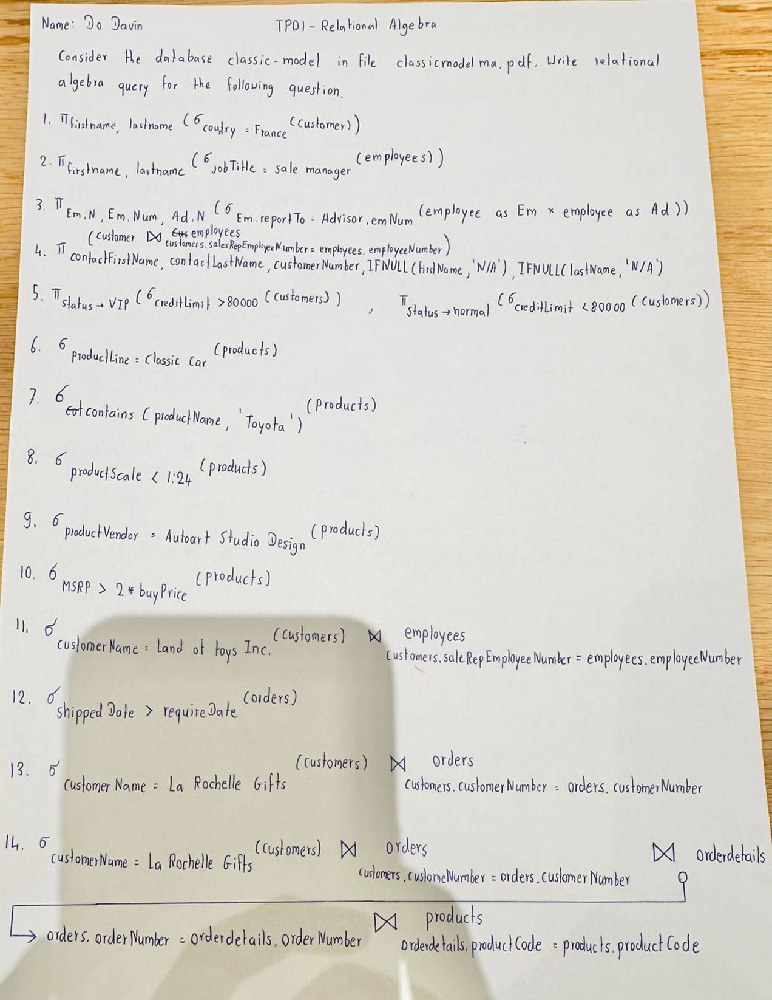
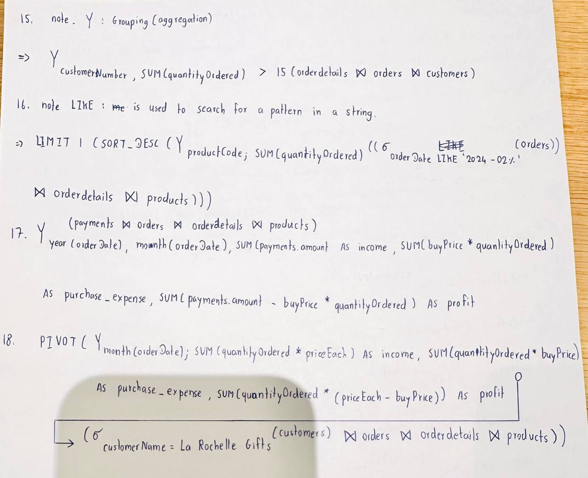

<center>

# TP01-RELATIONAL ALGEBRA

</center>

Consider the database classicmodel in le classicmodelschema.pdf. Write relational algebra query for the
following questions.

1. Show rst name and last name of customer from France.
   ```
   π_firstname, lastname (σ_country = 'France' (customers))
   ```

2. Show the rst name and last name of employee who is a sale manager.
   ```
   π_firstname, lastname (σ_jobTitle = 'sale manager' (employees))
    ```
3. Pair the name and number of employees along with the name of his/her advisor.
   ```
   π_Em.N, Em.Num, Ad.N (σ_Em.reportTo = 'Advisor.emNum(employees as Em x employees as Ad))
    ```
4. Pair the name and number of customers along with the name of sale representative that work with
them. If the sale representative is null, replace it with N/A.
   ```
   π_contactFirstName, contactLastName, customerNumber, IFNULL(firstName, 'N/A'), IFNULL(lastName, 'N/A') (customer ⨝_customers.salesRepEmployeeNumber = employees.employeeNumber employees)
   ```
5. Show information of customer, if the creditlimited is greater than 80 000, then the customer is vip. If
not he is normal.
   ```
   π_status->VIP (σ_creditLimit > 80000 (customers))
   π_status->normal (σ_creditLimit < 80000 (customers))
    ```
6. Show all product which is in “classic car” product line.
   ```
   σ_productLine = 'classic car' (products)
    ```
7. Show all products containing “Toyota” in its name.
   ```
   σ_contains (productName, 'Toyota') (products)
    ```
8. Show all products with the scale smaller than 1:24.
   ```
   σ_productScale < 1:24 (products)
    ```
9.  Show all products from the vendor “Autoart Studio Design”.
    ```
    σ_productVendor = 'Autoart Studio Design' (products)
    ```
10. Show all products with MSRP (the manufacturer’s suggested retail price) higher than twice the cost of
buyPrice.
    ```
    σ_MSRP > 2*buyPrice (products)
    ```
11. Show information of sale representative of the customer “Land of toys Inc.”
    ```
    σ_customerName = 'Land of toys Inc.' (customers) ⨝_customers.saleRepEmployeeNumber = employees.employeeNumber (employees)
    ```
12. Show information about order that is shipped later than the required date.
    ```
    σ_shippedDate > requireDate (orders)
    ```
13. Show all orders made by “La Rochelle Gifts”.
    ```
    σ_customerName = 'La Rochelle Gifts' (customers) ⨝_customers.customerNumber = orders.customerNumber (orders)
    ```
14. Show all products ordered by “La Rochelle Gifts”.
    ```
    σ_customerName = 'La Rochelle Gifts' (customers) ⨝_customers.customerNumber = orders.customerNumber (orders) ⨝_orders.orderNumber = orderdetails.orderNumber (orderdetails) ⨝_orderdetails.productCode = products.productCode (products)
    ```
15. Show customer’s name who has ordered more than 15 products in once.
    ```
    γ_customerNumber, SUM(quantityOrdered) > 15(orderdetails ⨝ orders ⨝ customers)
    ```
16. Show the most ordered product by quantity.Show the best-selling product in “2004-02”.
    ```
    LIMIT 1 (
      SORT_DESC (
        γ_productCode; SUM(quantityOrdered) ((σ_orderDate LIKE '2024-02%' (orders)) ⨝ orderdetails ⨝ products)
      )
    )
    ```
17. Show monthly income, purchase expense, and prot in a specic year. An order that is placed in which
month would be considered as part of income of that month; the state of shipment and payment are
taken into account.
    ```
    γ_year(orderDate), month(orderDate), SUM(payments.amount) AS income, SUM(buyPrice*quantityOrdered) AS purchase_expense, SUM(payments.amount - buyPrice*quantity) AS profit (payments ⨝ orders ⨝ orderdetails ⨝ products)
    ```
18. The same as number 14, but we want months as columns and incomes, purcase_expense, and prot as
rows.
    ```
    PIVOT (
      γ_month(orderDate);
        SUM(quantityOrdered * priceEach) AS income,
        SUM(quantityOrdered * buyPrice) AS purchase_expense,
        SUM(quantityOrdered * (priceEach - buyPrice)) AS profit
      (
        σ_customerName = 'La Rochelle Gifts' (customers)
        ⨝ orders
        ⨝ orderdetails
        ⨝ products
      )
    )
    ```

<center>

# Hand Writing

</center>





<center>

# END

</center>

