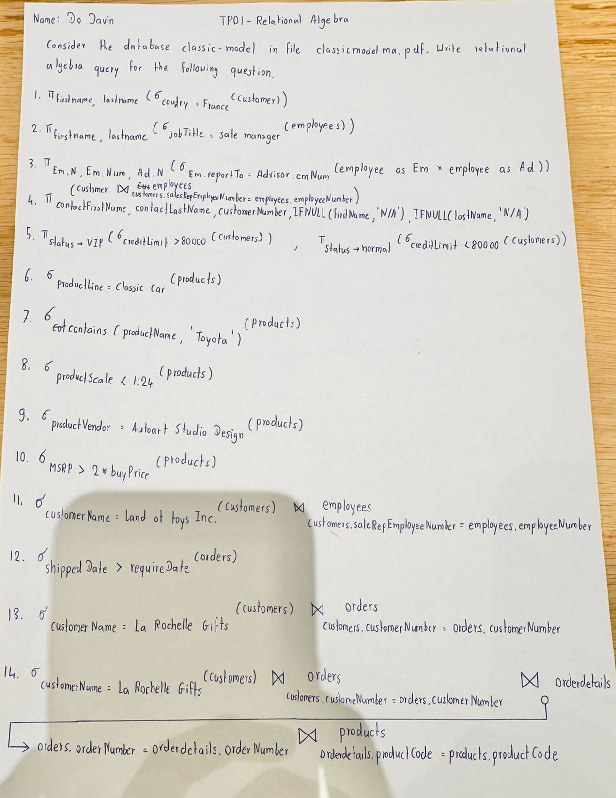
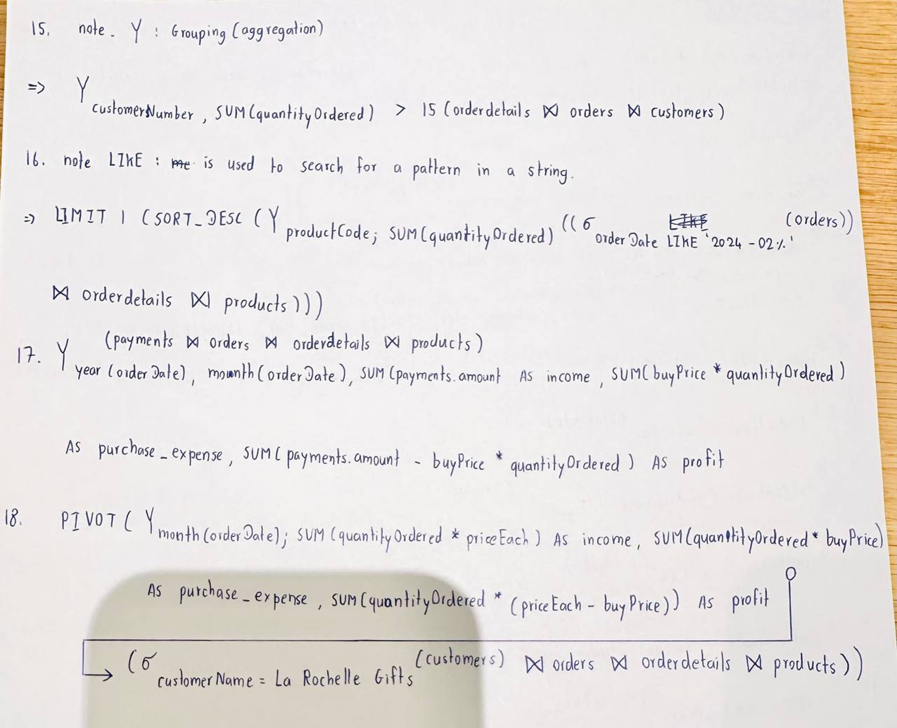
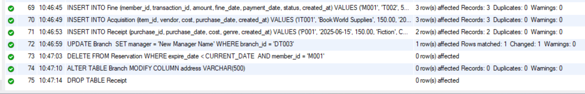

# Part1: Practice DDL

    1. CREATE all tables from schema TP04
    2. Add new column created_at TIMESTAMp to each table.

#   SQL:
```sql
    USE tp05;

    CREATE TABLE Branch(
        branch_id VARCHAR(100) PRIMARY KEY,
        manager VARCHAR(100) NOT NULL,
        name VARCHAR(100) NOT NULL,
        address VARCHAR(100) NOT NULL
    );

    CREATE TABLE Event(
        event_id VARCHAR(100) PRIMARY KEY,
        title VARCHAR(100) NOT NULL,
        date DATE NOT NULL,
        target_audience VARCHAR(100) NOT NULL,
        branch_id VARCHAR (100),
        FOREIGN KEY (branch_id) REFERENCES Branch(branch_id)  
    );

    CREATE TABLE Member (
        member_id VARCHAR(100) PRIMARY KEY,
        role VARCHAR(100) NOT NULL,
        name VARCHAR(100) NOT NULL,
        hired_date DATE NOT NULL,
        contact INT NOT NULL,
        dob DATE NOT NULL
    );

    CREATE TABLE Event_Registration(
        event_id VARCHAR(100),
        memeber_id VARCHAR(100),
        FOREIGN KEY (event_id) REFERENCES Event(event_id),
        FOREIGN KEY (memeber_id) REFERENCES Member(member_id)
    );

    CREATE TABLE Reservation(
        date_of_reservation DATE NOT NULL,
        expire_date DATE NOT NULL,
        hold_id VARCHAR(100) NOT NULL,
        status VARCHAR(100) NOT NULL,
        member_id VARCHAR(100),
        FOREIGN KEY (member_id) REFERENCES Member(member_id)
    );

    CREATE TABLE Item(
        item_id VARCHAR(100) PRIMARY KEY,
        genre VARCHAR(100) NOT NULL,
        type VARCHAR(100) NOT NULL,
        language VARCHAR(100) NOT NULL,
        isbn VARCHAR(100) NOT NULL,
        status VARCHAR(100) NOT NULL,
        branch_id VARCHAR(100),
        FOREIGN KEY (branch_id) REFERENCES Branch(branch_id)
    );

    CREATE TABLE Acquisition(
        vendor VARCHAR(100) NOT NULL,
        cost DOUBLE NOT NULL,
        purchase_date DATE NOT NULL,
        item_id VARCHAR(100),
        FOREIGN KEY (item_id) REFERENCES Item(item_id)
    );

    CREATE TABLE Receipt(
        purchase_id VARCHAR(100) PRIMARY KEY,
        purchase_date DATE NOT NULL,
        cost DOUBLE NOT NULL,
        genre VARCHAR(100) NOT NULL
    );

    CREATE TABLE Borrowing_Rule(
        item_type VARCHAR(100) PRIMARY KEY,
        loan_date DATE NOT NULL,
        fine_rule VARCHAR(100) NOT NULL
    );

    CREATE TABLE BorrowTransaction(
        transaction_id VARCHAR(100) PRIMARY KEY,
        cost DOUBLE NOT NULL,
        genere VARCHAR(100) NOT NULL,
        return_date DATE NOT NULL,
        return_condition VARCHAR(100) NOT NULL,
        member_id VARCHAR(100),
        branch_id VARCHAR(100),
        item_id VARCHAR(100),
        FOREIGN KEY (member_id) REFERENCES Member(member_id),
        FOREIGN KEY (branch_id) REFERENCES Branch(branch_id),
        FOREIGN KEY (item_id) REFERENCES Item(item_id)
    );

    CREATE TABLE Fine(
        amount INT NOT NULL,
        fine_date DATE NOT NULL,
        payment_date DATE NOT NULL,
        status VARCHAR(100) NOT NULL,
        member_id VARCHAR(100),
        transaction_id VARCHAR(100),
        FOREIGN KEY (member_id) REFERENCES Member(member_id),
        FOREIGN KEY (transaction_id) REFERENCES BorrowTransaction(transaction_id)
    );

    CREATE TABLE Emplyee(
        id VARCHAR(100) PRIMARY KEY,
        name VARCHAR(100) NOT NULL,
        dob DATE NOT NULL,
        hire_date DATE NOT NULL,
        contact INT NOT NULL
    );
```
# Output:

```sql
-- ALTER TABLE to add new column create_at TIMESTAMP to each table.

ALTER TABLE Branch ADD COLUMN created_at TIMESTAMP DEFAULT CURRENT_TIMESTAMP;
ALTER TABLE Event ADD COLUMN created_at TIMESTAMP DEFAULT CURRENT_TIMESTAMP;
ALTER TABLE Member ADD COLUMN created_at TIMESTAMP DEFAULT CURRENT_TIMESTAMP;
ALTER TABLE Event_Registration ADD COLUMN created_at TIMESTAMP DEFAULT CURRENT_TIMESTAMP;
ALTER TABLE Reservation ADD COLUMN created_at TIMESTAMP DEFAULT CURRENT_TIMESTAMP;
ALTER TABLE Item ADD COLUMN created_at TIMESTAMP DEFAULT CURRENT_TIMESTAMP;
ALTER TABLE Acquisition ADD COLUMN created_at TIMESTAMP DEFAULT CURRENT_TIMESTAMP;
ALTER TABLE Receipt ADD COLUMN created_at TIMESTAMP DEFAULT CURRENT_TIMESTAMP;
ALTER TABLE Borrowing_Rule ADD COLUMN created_at TIMESTAMP DEFAULT CURRENT_TIMESTAMP;
ALTER TABLE BorrowTransaction ADD COLUMN created_at TIMESTAMP DEFAULT CURRENT_TIMESTAMP;
ALTER TABLE Fine ADD COLUMN created_at TIMESTAMP DEFAULT CURRENT_TIMESTAMP;
ALTER TABLE Emplyee ADD COLUMN created_at TIMESTAMP DEFAULT CURRENT_TIMESTAMP;
```
# Output:

# Part 2: Practice DML

    1. INSERT: Add at least 3-5 entries per table
    2. UPDATE: Change or Modify something
    3. DELETE:Remove any entrie from the table
    4. DROP: Drop one sample table

# SQL:
```sql
-- ALTER TABLE to add new column create_at TIMESTAMP to each table.

ALTER TABLE Branch ADD COLUMN created_at TIMESTAMP DEFAULT CURRENT_TIMESTAMP;
ALTER TABLE Event ADD COLUMN created_at TIMESTAMP DEFAULT CURRENT_TIMESTAMP;
ALTER TABLE Member ADD COLUMN created_at TIMESTAMP DEFAULT CURRENT_TIMESTAMP;
ALTER TABLE Event_Registration ADD COLUMN created_at TIMESTAMP DEFAULT CURRENT_TIMESTAMP;
ALTER TABLE Reservation ADD COLUMN created_at TIMESTAMP DEFAULT CURRENT_TIMESTAMP;
ALTER TABLE Item ADD COLUMN created_at TIMESTAMP DEFAULT CURRENT_TIMESTAMP;
ALTER TABLE Acquisition ADD COLUMN created_at TIMESTAMP DEFAULT CURRENT_TIMESTAMP;
ALTER TABLE Receipt ADD COLUMN created_at TIMESTAMP DEFAULT CURRENT_TIMESTAMP;
ALTER TABLE Borrowing_Rule ADD COLUMN created_at TIMESTAMP DEFAULT CURRENT_TIMESTAMP;
ALTER TABLE BorrowTransaction ADD COLUMN created_at TIMESTAMP DEFAULT CURRENT_TIMESTAMP;
ALTER TABLE Fine ADD COLUMN created_at TIMESTAMP DEFAULT CURRENT_TIMESTAMP;
ALTER TABLE Emplyee ADD COLUMN created_at TIMESTAMP DEFAULT CURRENT_TIMESTAMP;

ALTER TABLE Emplyee RENAME TO Employee;

-- INSERT statements samples

INSERT INTO Branch (branch_id, manager, name, address, created_at) 
VALUES
	('DT001', 'Kol Thyda', 'Phnom Penh Central Library', 'Road 192, Phnom Penh', CURRENT_TIMESTAMP),
    ('DT002', 'Do Davin', 'Siem Reap Campus Library', 'Road 60, Siem Reap', CURRENT_TIMESTAMP),
    ('DT003', 'Scar King', 'Battambang Regional Library', 'Street 1.5, Battambang', CURRENT_TIMESTAMP);
    
INSERT INTO Employee (id, name, dob, role, hire_date, contact, created_at)
VALUES 
	('EM001', 'Alice Chan', '1990-04-15', 'Software Engineering', '2020-06-01', 123456789, CURRENT_TIMESTAMP),
	('EM002', 'Bora Seng', '1985-09-30', 'IT Support', '2018-02-20', 987654321, CURRENT_TIMESTAMP),
	('EM003', 'Dara Kim', '1992-12-10', 'Administrator', '2021-01-15', 876543210, CURRENT_TIMESTAMP);
    
INSERT INTO Event (event_id, branch_id, title, date, target_audience, created_at)
VALUES 
	('EV001', 'DT001', 'Summer Reading Program', '2025-07-01', 'Children', CURRENT_TIMESTAMP),
	('EV002', 'DT002', 'Tech Workshop', '2025-08-15', 'Young Adults', CURRENT_TIMESTAMP),
	('EV003', 'DT003', 'Author Talk', '2025-09-05', 'General Public', CURRENT_TIMESTAMP);

INSERT INTO Member (member_id, role, name, hired_date, contact, dob, created_at)
VALUES 
	('M001', 'Librarian', 'Sokun Nary', '2022-03-10', 123123123, '1990-07-12', CURRENT_TIMESTAMP),
	('M002', 'Assistant', 'Chan Dara', '2023-01-05', 456456456, '1995-11-22', CURRENT_TIMESTAMP),
	('M003', 'Volunteer', 'Kanha Meas', '2024-05-20', 789789789, '2000-02-18', CURRENT_TIMESTAMP);

INSERT INTO Item (item_id, branch_id, genre, type, language, isbn, status, created_at)
VALUES
	('IT001', 'DT001', 'Fiction', 'Book', 'English', '978-0-123456-47-2', 'Available', CURRENT_TIMESTAMP),
	('IT002', 'DT002', 'Science', 'Magazine', 'Khmer', '978-1-234567-89-0', 'Checked Out', CURRENT_TIMESTAMP),
	('IT003', 'DT003', 'Technology', 'DVD', 'English', '978-0-987654-32-1', 'Available', CURRENT_TIMESTAMP);

INSERT INTO Borrowing_Rule (item_type, loan_date, fine_rule, created_at)
VALUES 
	('Book', '2025-06-01', '500 Riel per day after due date', CURRENT_TIMESTAMP),
	('DVD', '2025-06-01', '1000 Riel per day after due date', CURRENT_TIMESTAMP),
	('Magazine', '2025-06-01', 'No fine, return within 3 days', CURRENT_TIMESTAMP);
    
INSERT INTO Reservation (hold_id, member_id, date_of_reservation, expire_date, status, created_at)
VALUES
	('H001', 'M001', '2025-06-20', '2025-06-27', 'Active', CURRENT_TIMESTAMP),
	('H002', 'M002', '2025-06-18', '2025-06-25', 'Expired', CURRENT_TIMESTAMP),
	('H003', 'M003', '2025-06-22', '2025-06-29', 'Active', CURRENT_TIMESTAMP);
    
INSERT INTO Reservation (member_id, item_id, date_of_reservation, expire_date, hold_id, status, created_at)
VALUES
	('M001', 'IT001', '2025-06-20', '2025-06-27', 'HOLD001', 'Active', CURRENT_TIMESTAMP),
	('M002', 'IT002', '2025-06-18', '2025-06-25', 'HOLD002', 'Expired', CURRENT_TIMESTAMP),
	('M003', 'IT003', '2025-06-22', '2025-06-29', 'HOLD003', 'Pending', CURRENT_TIMESTAMP);

INSERT INTO Event_Registration (event_id, member_id, created_at)
VALUES
	('EV001', 'M001', CURRENT_TIMESTAMP),
	('EV002', 'M002', CURRENT_TIMESTAMP),
	('EV003', 'M003', CURRENT_TIMESTAMP);
    
INSERT INTO BorrowTransaction (transaction_id, member_id, branch_id, item_id, cost, genere, return_date, return_condition, created_at)
VALUES
	('T001', 'M001', 'DT001', 'IT001',  0.0, 'Fiction', '2025-07-01', 'Good', CURRENT_TIMESTAMP),
	('T002', 'M002', 'DT002', 'IT002',  2.5, 'Science', '2025-06-28', 'Damaged', CURRENT_TIMESTAMP),
	('T003', 'M003', 'DT003', 'IT003',  0.0, 'Technology', '2025-07-05', 'Good', CURRENT_TIMESTAMP);

INSERT INTO Fine (member_id, transaction_id, amount, fine_date, payment_date, status, created_at)
VALUES
	('M001', 'T002', 500, '2025-06-20', '2025-06-22', 'Paid', CURRENT_TIMESTAMP),
    ('M002', 'T003', 1000, '2025-06-25', '2025-06-21', 'Unpaid', CURRENT_TIMESTAMP),
    ('M003', 'T001', 200, '2025-06-18', '2025-06-19', 'Paid', CURRENT_TIMESTAMP);
    
INSERT INTO Acquisition (item_id, vendor, cost, purchase_date, created_at)
VALUES
	('IT001', 'BookWorld Supplies', 150.00, '2025-05-10', CURRENT_TIMESTAMP),
    ('IT003', 'TechGear Inc.', 300.50, '2025-06-01', CURRENT_TIMESTAMP),
    ('IT002', 'Magazine Hub', 75.25, '2025-04-20', CURRENT_TIMESTAMP);
    
INSERT INTO Receipt (purchase_id, purchase_date, cost, genre, created_at)
VALUES
	('P001', '2025-06-15', 150.00, 'Fiction', CURRENT_TIMESTAMP),
	('P002', '2025-06-20', 300.50, 'Technology', CURRENT_TIMESTAMP);

-- Update: Change in a branch manager

UPDATE Branch 
SET manager = 'New Manager Name'
WHERE branch_id = 'DT003';

-- DELETE FROM Reservation

DELETE FROM Reservation
WHERE expire_date < CURRENT_DATE 
AND member_id = 'M001';

-- Modify a column type

ALTER TABLE Branch
MODIFY COLUMN address VARCHAR(500);

-- Drop a table
DROP TABLE Receipt;
```
# Output:

