```sql
USE classicmodels;

-- 1. Show rst name and last name of customer from France.
-- (Hint: SELECT, WHERE clause on country column from customers)

SELECT contactLastName, contactFirstName FROM Customers WHERE country = 'France';
```
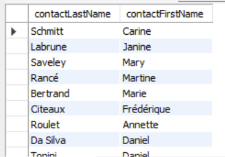

```sql
-- 2. Show the rst name and last name of employee who is a sale manager.
-- (Hint: SELECT, WHERE on jobTitle in employees)

SELECT firstName, lastName, jobTitle FROM Employees WHERE jobTitle LIKE 'sale%manager%';
```
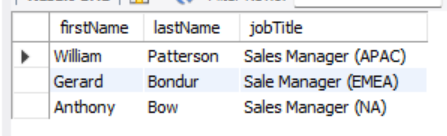

```sql
-- 3. Pair the name and number of employees along with the name of his/her advisor.
-- (Hint: SELF JOIN on employees using employeeNumber = reportsTo)

SELECT concat(e1.firstName, ' ', e1.lastName) as name, 
	   e2.employeeNumber, concat(e2.firstName, ' ', e2.lastName) AS AdvName FROM employees AS e1 
       LEFT JOIN employees AS e2 ON e1.reportsTo = e2.employeeNumber;
```
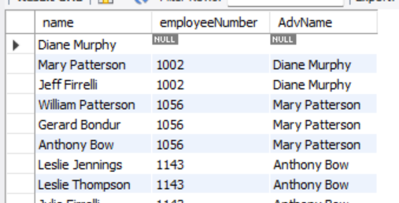

```sql   
-- 4. Pair the name and number of customers along with the name of sale representative that works with
-- them. If the sale representative is null, replace iwith N/A.**
-- (Hint: LEFT JOIN between customers and employees with COALESCE)

SELECT c.contactLastName, c.contactFirstName, e.lastName, e.firstName
	FROM customers AS c JOIN employees AS e
    ON c.salesRepEmployeeNumber = e.employeeNumber;
```
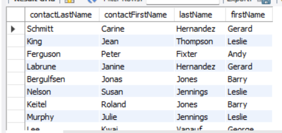

```sql
-- 5. Show information of customer, if the creditlimit is greater than 80000, then the customer is VIP. If not,
-- he is normal.
-- (Hint: SELECT, CASE WHEN or IF on creditLimit from customers)

SELECT *, IF(creditLimit > 80000, 'VIP', 'NORMAL') AS status FROM customers;
```
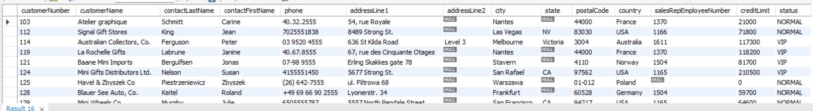

```sql
-- 6. Show all products which are in “classic car” product line.
-- (Hint: SELECT, WHERE on productLine from products)

SELECT * FROM products WHERE productLine LIKE '%classic%car%';
```
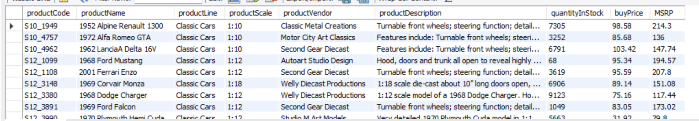

```sql
-- 7. Show all products containing “Toyota” in its name.
-- (Hint: SELECT, LIKE clause on productName from products)

SELECT * FROM products WHERE productName LIKE '%Toyota%';
```
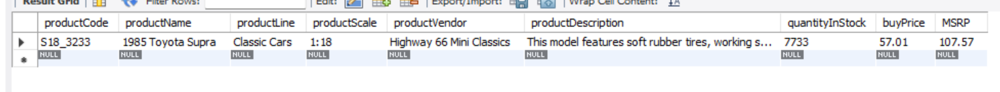

```sql
-- 8. Show all products with the scale smaller than 1:24.
-- (Hint: SELECT, consider CAST/CONVERT on productScale string if comparison needed)

SELECT * FROM products WHERE CAST(SUBSTRING_INDEX(productScale, ':', -1) AS DECIMAL) < 24; 
```
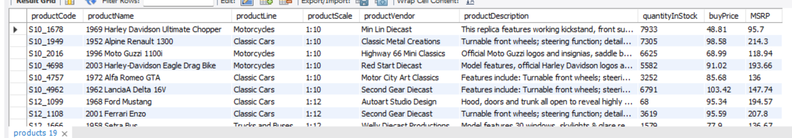

```sql
-- 9. Show all products from the vendor “Autoart Studio Design”.
-- (Hint: SELECT, WHERE on productVendor from products)

SELECT * FROM products WHERE productVendor LIKE '%autoart%studio%design%';
```
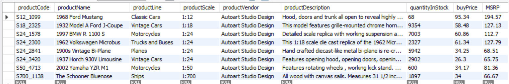

```sql
-- 10. Show all products with MSRP higher than twice the cost of buyPrice.
-- (Hint: SELECT, WHERE with comparison expression: MSRP > 2 * buyPrice)

SELECT * FROM products WHERE MSRP > 2 * buyPrice;
```
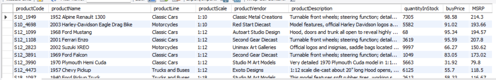

```sql
-- 11. Show information of sale representative of the customer “Land of Toys Inc.”
-- (Hint: JOIN between customers and employees on salesRepEmployeeNumber)

SELECT * FROM customers AS c JOIN employees AS e ON c.salesRepEmployeeNumber = e.employeeNumber WHERE customerName LIKE '%land%of%toys%inc%';
```
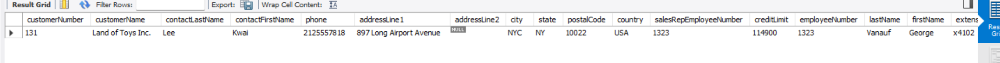

```sql
-- 12. Show information about order that is shipped later than the required date.
-- (Hint: SELECT, WHERE on orders with shippedDate > requiredDate)

SELECT * FROM orders WHERE shippedDate > requiredDate;
```
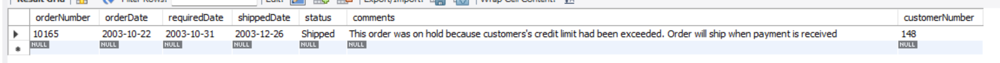

```sql
-- 13. Show all orders made by “La Rochelle Gifts”.
-- (Hint: JOIN between orders and customers on customerNumber, WHERE customerName)

SELECT *, customerName FROM orders JOIN customers WHERE customerName LIKE '%la%rochelle%gifts';
```
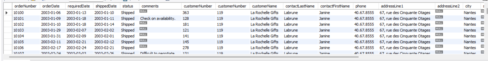
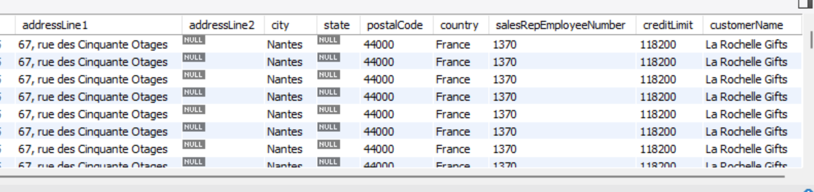

```sql
-- 14. Show all products ordered by “La Rochelle Gifts”.
-- (Hint: JOIN across customers, orders, orderdetails, and products)

SELECT * FROM customers AS c 
	JOIN orders AS o ON c.customerNumber = o.customerNumber 
    JOIN orderdetails AS od ON o.orderNumber = od.orderNumber
    JOIN products AS p ON p.productCode = od.productCode
    WHERE c.customerName = 'La Rochelle Gifts';
```
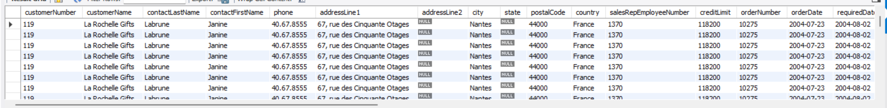

```sql
-- 15. Show customer’s name who has ordered more than 15 products in once.
-- (Hint: JOIN, GROUP BY, HAVING, count quantityOrdered)

SELECT c.customerName FROM customers c
JOIN orders o ON c.customerNumber = o.customerNumber
JOIN orderdetails od ON o.orderNumber = od.orderNumber
GROUP BY o.orderNumber
HAVING SUM(od.quantityOrdered) > 15;
```
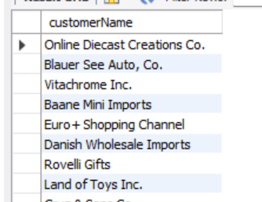

```sql
-- 16. Show the best-selling product in “2004-02”.
-- (Hint: JOIN, SUM(quantityOrdered), GROUP BY, ORDER BY, LIMIT 1, lter orderDate by
-- month)

SELECT p.productName, SUM(od.quantityOrdered) AS totalSold
	FROM orderdetails od
    JOIN orders o ON od.orderNumber = o.orderNumber
    JOIN products p ON od.productCode = p.productCode
    WHERE o.orderDate LIKE '2004-02%'
    GROUP BY p.productCode
    ORDER BY totalSold DESC
    LIMIT 1;
```
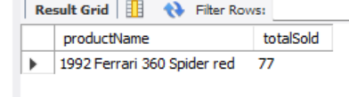

```sql
-- 17. Find the lowest sale price of each product.
-- (Hint: SELECT, MIN(priceEach), GROUP BY productCode from orderdetails)

SELECT productCode, MIN(priceEach) FROM orderdetails GROUP BY productCode;
```
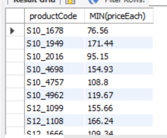 

```sql
-- 18. Find the biggest gap of sale price of each product.
-- (Hint: SELECT, MAX(priceEach) - MIN(priceEach), GROUP BY productCode)

SELECT productCode, MAX(priceEach) - MIN(priceEach) AS priceGap FROM orderdetails 
	GROUP BY productCode;
```
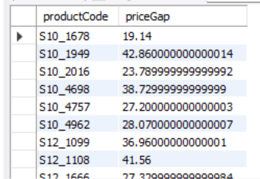

```sql
-- 19. Find the product with the biggest gap of sale price.
-- (Hint: Use subquery from #18, ORDER BY gap DESC, LIMIT 1)

SELECT productCode, priceGap FROM (
	SELECT productCode, MAX(priceEach) - MIN(priceEach) AS priceGap FROM orderdetails
    GROUP BY productCode
) AS priceGaps
ORDER BY priceGap DESC
LIMIT 1;
```
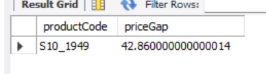

```sql
-- 20. Find the total cost of all orders of each customer.
-- (Hint: JOIN customers, orders, orderdetails; SUM(priceEach * quantityOrdered),
-- GROUP BY customer)

SELECT c.customerName, SUM(od.priceEach * od.quantityOrdered) AS totalOrderCost
	FROM customers c
    JOIN orders o ON c.customerNumber = o.customerNumber
    JOIN orderdetails od ON o.orderNumber = od.orderNumber
    GROUP BY c.customerNumber;
```
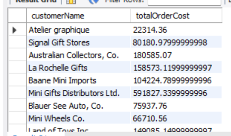

```sql
-- 21. Find the top customer (with the highest total sale cost) of each city.
-- (Hint: JOIN, SUM(...), GROUP BY city, customerName, RANK() or ROW_NUMBER() partitioned
-- by city)

WITH CustomerSale AS (
	SELECT c.customerName, c.city,
    SUM(od.priceEach * od.quantityOrdered) AS totalSale,
    ROW_NUMBER() OVER (PARTITION BY c.city ORDER BY SUM(od.priceEach * od.quantityOrdered) DESC) AS rankInCity
    FROM customers c
    JOIN orders o ON c.customerNumber = o.customerNumber
    JOIN orderdetails od ON o.orderNumber = od.orderNumber
    GROUP BY c.customerNumber, c.city
)
SELECT customerName, city, totalSale
FROM CustomerSale
WHERE rankInCity = 1;
```
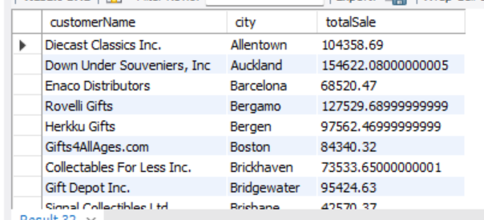

```sql
-- 22. Show monthly income, purchase expense, and prot in a specic year. An order that is placed in which
-- month would be considered as part of income of that month; the state of shipment and payment are
-- taken into account.
-- (Hint: JOIN, use MONTH(orderDate), SUM(quantityOrdered * priceEach), buyPrice, GROUP
-- BY MONTH)

SELECT
	MONTH(o.orderDate) AS month,
    SUM(od.quantityOrdered * od.priceEach) AS income,
    SUM(od.quantityOrdered * p.buyPrice) AS expense,
    SUM(od.quantityOrdered * (od.priceEach - p.buyPrice)) AS profit
FROM orders o
JOIN orderdetails od ON o.orderNumber = od.orderNumber
JOIN products p ON od.productCode = p.productCode
WHERE YEAR(o.orderDate) = 2004
GROUP BY MONTH(o.orderDate)
ORDER BY month;
```
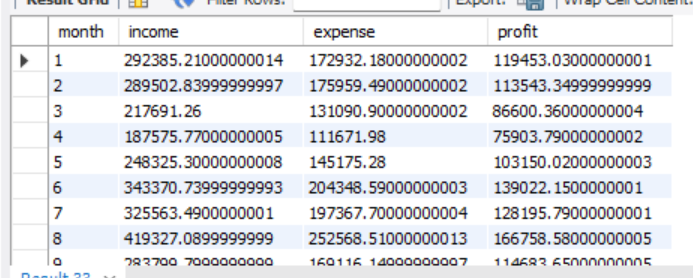

```sql
-- 23. The same as number 14, but we want months as columns and incomes, purcase_expense, and prot as
-- rows.
-- (Hint: PIVOT or CASE WHEN with aggregation in SELECT to simulate pivot)

SELECT 
	'Income' AS financial_type,
    SUM(CASE WHEN MONTH(o.orderDate) = 1 THEN od.quantityOrdered * od.priceEach ELSE 0 END) AS January,
    SUM(CASE WHEN MONTH(o.orderDate) = 2 THEN od.quantityOrdered * od.priceEach ELSE 0 END) AS February, 
    SUM(CASE WHEN MONTH(o.orderDate) = 3 THEN od.quantityOrdered * od.priceEach ELSE 0 END) AS March, 
    SUM(CASE WHEN MONTH(o.orderDate) = 4 THEN od.quantityOrdered * od.priceEach ELSE 0 END) AS April,
    SUM(CASE WHEN MONTH(o.orderDate) = 5 THEN od.quantityOrdered * od.priceEach ELSE 0 END) AS May, 
    SUM(CASE WHEN MONTH(o.orderDate) = 6 THEN od.quantityOrdered * od.priceEach ELSE 0 END) AS June, 
    SUM(CASE WHEN MONTH(o.orderDate) = 7 THEN od.quantityOrdered * od.priceEach ELSE 0 END) AS July, 
    SUM(CASE WHEN MONTH(o.orderDate) = 8 THEN od.quantityOrdered * od.priceEach ELSE 0 END) AS August, 
    SUM(CASE WHEN MONTH(o.orderDate) = 9 THEN od.quantityOrdered * od.priceEach ELSE 0 END) AS September, 
    SUM(CASE WHEN MONTH(o.orderDate) = 10 THEN od.quantityOrdered * od.priceEach ELSE 0 END) AS October, 
    SUM(CASE WHEN MONTH(o.orderDate) = 11 THEN od.quantityOrdered * od.priceEach ELSE 0 END) AS November, 
    SUM(CASE WHEN MONTH(o.orderDate) = 12 THEN od.quantityOrdered * od.priceEach ELSE 0 END) AS December
FROM orders o
JOIN orderdetails od ON o.orderNumber = od.orderNumber
JOIN products p ON od.productCode = p.productCode
WHERE YEAR(o.orderDate) = 2004

UNION ALL

SELECT
	'Purchase Expense' AS financial_type,
    SUM(CASE WHEN MONTH(o.orderDate) = 1 THEN od.quantityOrdered * p.buyPrice ELSE 0 END),
	SUM(CASE WHEN MONTH(o.orderDate) = 2 THEN od.quantityOrdered * p.buyPrice ELSE 0 END),
    SUM(CASE WHEN MONTH(o.orderDate) = 3 THEN od.quantityOrdered * p.buyPrice ELSE 0 END),
    SUM(CASE WHEN MONTH(o.orderDate) = 4 THEN od.quantityOrdered * p.buyPrice ELSE 0 END),
    SUM(CASE WHEN MONTH(o.orderDate) = 5 THEN od.quantityOrdered * p.buyPrice ELSE 0 END),
    SUM(CASE WHEN MONTH(o.orderDate) = 6 THEN od.quantityOrdered * p.buyPrice ELSE 0 END),
    SUM(CASE WHEN MONTH(o.orderDate) = 7 THEN od.quantityOrdered * p.buyPrice ELSE 0 END),
    SUM(CASE WHEN MONTH(o.orderDate) = 8 THEN od.quantityOrdered * p.buyPrice ELSE 0 END),
    SUM(CASE WHEN MONTH(o.orderDate) = 9 THEN od.quantityOrdered * p.buyPrice ELSE 0 END),
    SUM(CASE WHEN MONTH(o.orderDate) = 10 THEN od.quantityOrdered * p.buyPrice ELSE 0 END),
    SUM(CASE WHEN MONTH(o.orderDate) = 11 THEN od.quantityOrdered * p.buyPrice ELSE 0 END),
    SUM(CASE WHEN MONTH(o.orderDate) = 12 THEN od.quantityOrdered * p.buyPrice ELSE 0 END)
FROM orders o
JOIN orderdetails od ON o.orderNumber = od.orderNumber
JOIN products p ON od.productCode = p.productCode
WHERE YEAR(o.orderDate) = 2004

UNION ALL

SELECT
	'Profit' AS financial_type,
    SUM(CASE WHEN MONTH(o.orderDate) = 1 THEN od.quantityOrdered * (od.priceEach - p.buyPrice) ELSE 0 END),
    SUM(CASE WHEN MONTH(o.orderDate) = 2 THEN od.quantityOrdered * (od.priceEach - p.buyPrice) ELSE 0 END),
    SUM(CASE WHEN MONTH(o.orderDate) = 3 THEN od.quantityOrdered * (od.priceEach - p.buyPrice) ELSE 0 END),
    SUM(CASE WHEN MONTH(o.orderDate) = 4 THEN od.quantityOrdered * (od.priceEach - p.buyPrice) ELSE 0 END),
    SUM(CASE WHEN MONTH(o.orderDate) = 5 THEN od.quantityOrdered * (od.priceEach - p.buyPrice) ELSE 0 END),
    SUM(CASE WHEN MONTH(o.orderDate) = 6 THEN od.quantityOrdered * (od.priceEach - p.buyPrice) ELSE 0 END),
    SUM(CASE WHEN MONTH(o.orderDate) = 7 THEN od.quantityOrdered * (od.priceEach - p.buyPrice) ELSE 0 END),
    SUM(CASE WHEN MONTH(o.orderDate) = 8 THEN od.quantityOrdered * (od.priceEach - p.buyPrice) ELSE 0 END),
    SUM(CASE WHEN MONTH(o.orderDate) = 9 THEN od.quantityOrdered * (od.priceEach - p.buyPrice) ELSE 0 END),
    SUM(CASE WHEN MONTH(o.orderDate) = 10 THEN od.quantityOrdered * (od.priceEach - p.buyPrice) ELSE 0 END),
    SUM(CASE WHEN MONTH(o.orderDate) = 11 THEN od.quantityOrdered * (od.priceEach - p.buyPrice) ELSE 0 END),
    SUM(CASE WHEN MONTH(o.orderDate) = 12 THEN od.quantityOrdered * (od.priceEach - p.buyPrice) ELSE 0 END)
FROM orders o
JOIN orderdetails od ON o.orderNumber = od.orderNumber
JOIN products p ON od.productCode = p.productCode
WHERE YEAR(o.orderDate) = 2004;
```
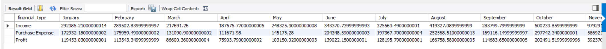
